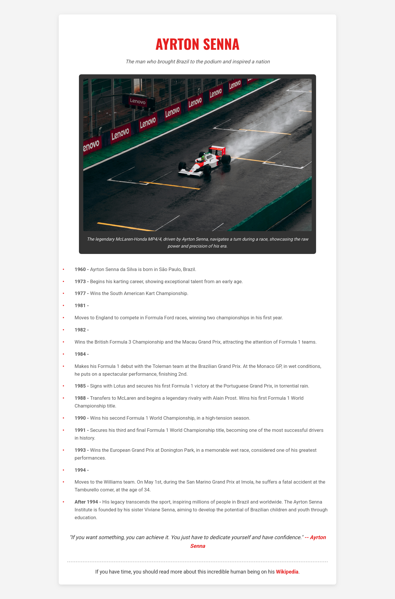

# 🏁 Ayrton Senna Tribute Page

-----

## 🇧🇷 Português

### 🎯 Objetivo do Projeto

Este projeto é uma **Página de Homenagem (Tribute Page)** dedicada a Ayrton Senna, desenvolvida como parte dos desafios do curso **"Responsive Web Design" do freeCodeCamp**. O objetivo principal foi criar uma página estática, informativa e visualmente agradável, utilizando HTML e CSS para estruturar o conteúdo e aplicar um design responsivo.

### 🖼️ Visão Geral do Projeto



### ✨ Funcionalidades

A página de homenagem a Ayrton Senna inclui as seguintes seções e elementos:

  * **Título Principal:** Um título proeminente que apresenta Ayrton Senna.
  * **Descrição:** Uma breve frase descrevendo seu impacto.
  * **Imagem Principal:** Uma imagem de destaque com uma legenda (`figcaption`) que contextualiza a foto.
  * **Linha do Tempo:** Uma lista detalhada dos principais marcos na vida e carreira de Senna, apresentada de forma clara e cronológica.
  * **Citação Inspiradora:** Uma citação famosa de Ayrton Senna, com um link para o site oficial.
  * **Link para Mais Informações:** Um link para a página da Wikipédia de Ayrton Senna, para que os usuários possam aprofundar seus conhecimentos.

### 🚀 Tecnologias Utilizadas

  * **HTML5:** Estrutura semântica de toda a página, garantindo a organização do conteúdo.
  * **CSS3:** Estilização completa da página, incluindo:
      * **Tipografia:** Utilização de fontes do Google (`Roboto` e `Oswald`) para um design atraente.
      * **Cores e Layout:** Paleta de cores que remete ao universo da Fórmula 1 e ao Brasil, com um layout limpo e fácil de ler.
      * **Design Responsivo:** Implementação de `media queries` para garantir que a página se adapte e seja visualmente agradável em dispositivos de diferentes tamanhos (desktops, tablets e smartphones).

### 🎨 Design

O design da página foi pensado para ser **elegante e respeitoso**, com foco na legibilidade e na apresentação da linha do tempo. As cores foram escolhidas para evocar a paixão e a grandiosidade da trajetória de Senna, enquanto a responsividade assegura uma experiência de usuário consistente em qualquer dispositivo.

### 🔗 Acesso ao Projeto

Você pode visualizar este projeto diretamente no GitHub Pages (se você configurá-lo) ou clonar o repositório para executá-lo localmente:

```bash
git clone https://github.com/GabrielMassensini/freecodecamp-tribute-page.git
cd freecodecamp-tribute-page
```

Basta abrir o arquivo `index.html` em seu navegador web preferido.

### 🌟 Status do Projeto

Concluído e passando em todos os testes do desafio do freeCodeCamp.

-----

## 🇬🇧 English

### 🎯 Project Objective

This project is a **Tribute Page** dedicated to Ayrton Senna, developed as part of the **"Responsive Web Design" course challenges from freeCodeCamp**. The main goal was to create a static, informative, and visually appealing page, using HTML and CSS to structure the content and apply a responsive design.

### 🖼️ Project Overview


### ✨ Features

The Ayrton Senna tribute page includes the following sections and elements:

  * **Main Title:** A prominent title introducing Ayrton Senna.
  * **Description:** A brief phrase describing his impact.
  * **Main Image:** A featured image with a `figcaption` that contextualizes the photo.
  * **Timeline:** A detailed list of key milestones in Senna's life and career, presented clearly and chronologically.
  * **Inspirational Quote:** A famous quote from Ayrton Senna, with a link to his official website.
  * **Link for More Information:** A link to Ayrton Senna's Wikipedia page, so users can deepen their knowledge.

### 🚀 Technologies Used

  * **HTML5:** Semantic structure for the entire page, ensuring content organization.
  * **CSS3:** Complete styling of the page, including:
      * **Typography:** Use of Google Fonts (`Roboto` and `Oswald`) for an appealing design.
      * **Colors and Layout:** A color palette that evokes the world of Formula 1 and Brazil, with a clean and easy-to-read layout.
      * **Responsive Design:** Implementation of `media queries` to ensure the page adapts and is visually appealing on devices of different sizes (desktops, tablets, and smartphones).

### 🎨 Design

The page's design was intended to be **elegant and respectful**, focusing on readability and the presentation of the timeline. Colors were chosen to evoke the passion and grandeur of Senna's journey, while responsiveness ensures a consistent user experience on any device.

### 🔗 Project Access

You can view this project directly on GitHub Pages (if you set it up) or clone the repository to run it locally:

```bash
git clone https://github.com/GabrielMassensini/freecodecamp-tribute-page.git
cd freecodecamp-tribute-page
```

Simply open the `index.html` file in your preferred web browser.

### 🌟 Project Status

Completed and passed all freeCodeCamp challenge tests.

-----

## 👤 Author

**Gabriel Alves Massensini**
